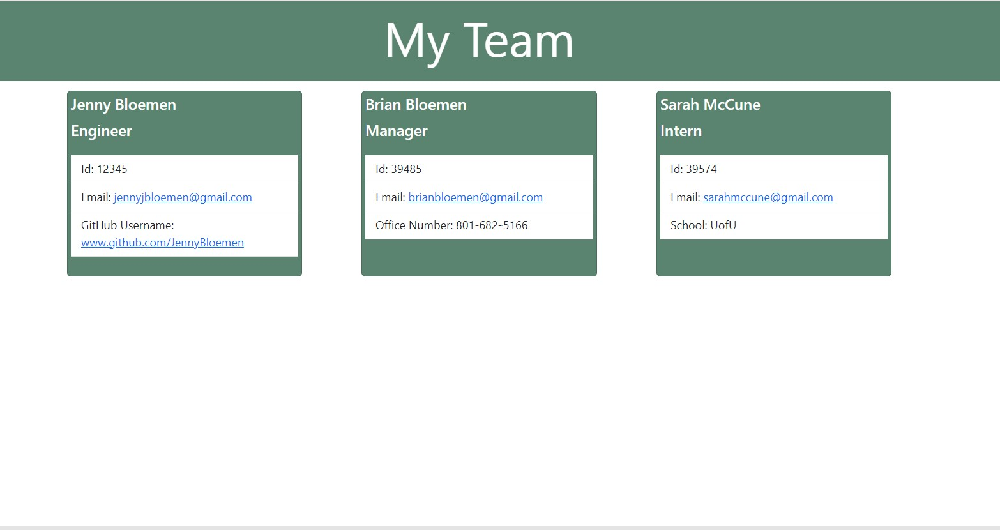

<h1>Team Project Builder</h1>

<h3>Description</h3>
For this project I was tasked to build a Node.js command-line application that takes in information about employees on a software engineering team, then generates an HTML webpage that displays summaries for each person. Testing is key to making code maintainable, so you’ll also write a unit test for every part of your code and ensure that it passes each test.

Because this application won’t be deployed, you’ll need to provide a link to a walkthrough video that demonstrates its functionality and all of the tests passing. You’ll need to submit a link to the video AND add it to the readme of your project.
  
<h3>Project Requirements</h3>
<ul>
<li>GIVEN a command-line application that accepts user input</li>
<li>WHEN I am prompted for my team members and their information</li>
<li>THEN an HTML file is generated that displays a nicely formatted team roster based on user input</li>
<li>WHEN I click on an email address in the HTML</li>
<li>THEN my default email program opens and populates the TO field of the email with the address</li>
<li>WHEN I click on the GitHub username</li>
<li>THEN that GitHub profile opens in a new tab</li>
<li>WHEN I start the application</li>
<li>THEN I am prompted to enter the team manager’s name, employee ID, email address, and office number</li>
<li>WHEN I enter the team manager’s name, employee ID, email address, and office number</li>
<li>THEN I am presented with a menu with the option to add an engineer or an intern or to finish building my team</li>
<li>WHEN I select the engineer option</li>
<li>THEN I am prompted to enter the engineer’s name, ID, email, and GitHub username, and I am taken back to the menu</li>
<li>WHEN I select the intern option</li>
<li>THEN I am prompted to enter the intern’s name, ID, email, and school, and I am taken back to the menu</li>
<li>WHEN I decide to finish building my team</li>
<li>THEN I exit the application, and the HTML is generated</li>
</ul>

 
<h3>Links to Page and Walk Through</h3>
  <ul>
    <li>GitHub Repo: https://github.com/JennyBloemen/TeamProfileGenerator.git </li>
    <li>Screencastify Walk Through: https://drive.google.com/file/d/1_pWCL1GwYHYDTvoPGGRzwOh5g_nopbFI/view?usp=sharing </li>
  </ul> 
   

 
<h3>Screenshot of Application</h3>

 
<h3>Tools</h3>
<ul>
  <li>Node</li>
  <li>Bootstrap</li>
  <li>Javascript</li>
  <li>ScreenCastify</li>
</ul>
  